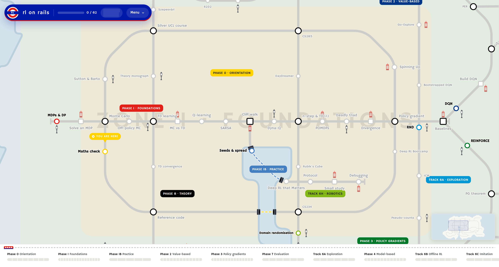

# [rlonrails.com](https://rlonrails.com)



## Deployment

Local
```sh
make up
```

Production — [rlonrails.com](https://rlonrails.com), tracks the newest stable
`v*` tag
```sh
make deploy
```

Development — [dev.rlonrails.com](https://dev.rlonrails.com), tracks `main`
```sh
make deploy-dev
```

Merging to `main` refreshes the development site. Publishing a release moves
production to that tag; pre-releases (`v2.0.0-rc1`) are skipped, so production
only ever lands on a stable one.

Both events reach the homeserver through the same fixed SSH command, so
`deploy` sets production and then hands off to the development checkout beside
it (`DEV_CHECKOUT`, default `../dev.rlonrails.com`). The two targets reset
their checkout to different refs, so they need separate clones — on the
homeserver those are the `rlonrails.com` and `dev.rlonrails.com` submodules of
[docker-containers](https://github.com/subeenregmi/docker-containers).
